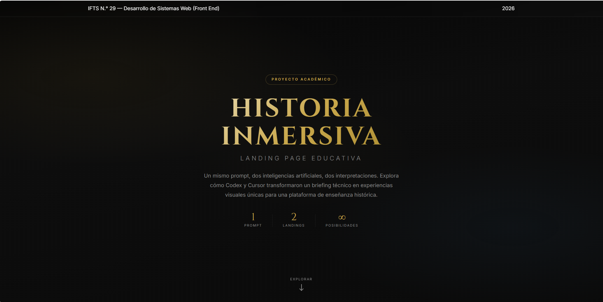
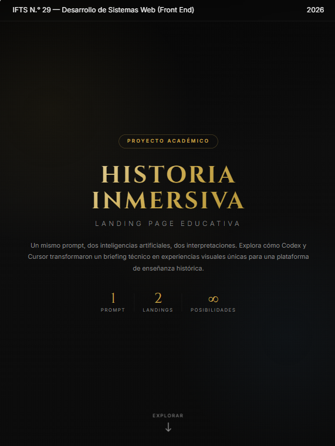
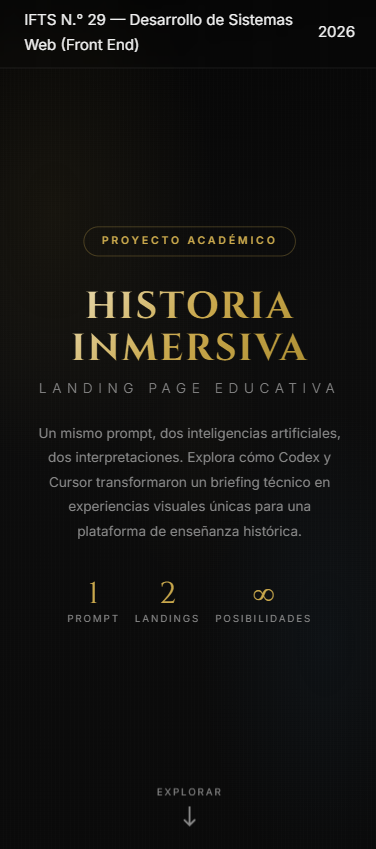
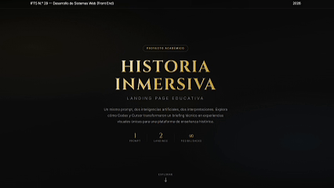
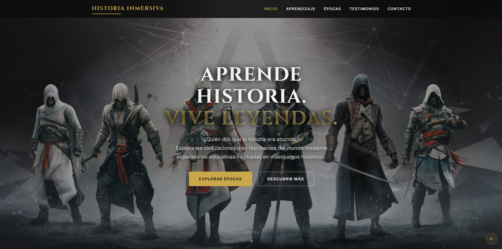
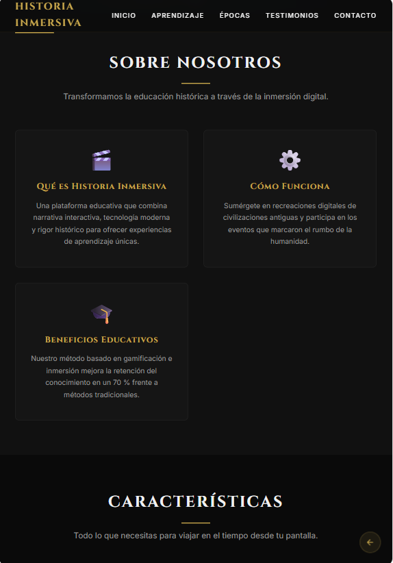
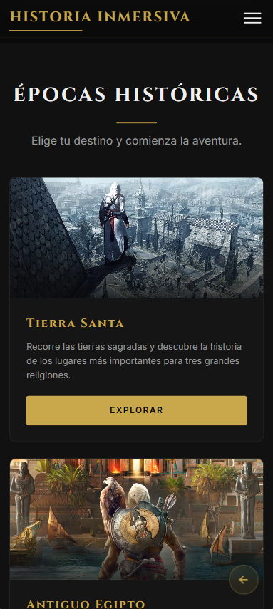
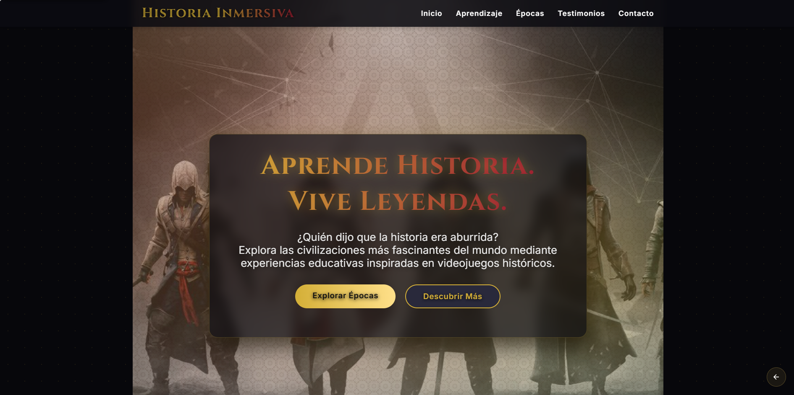
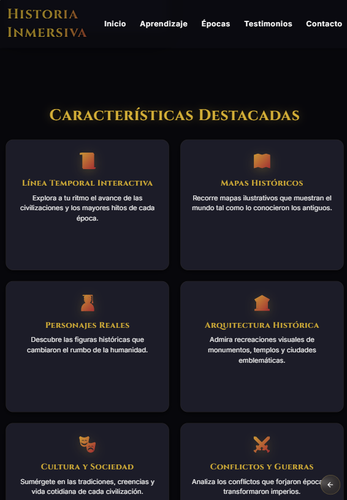
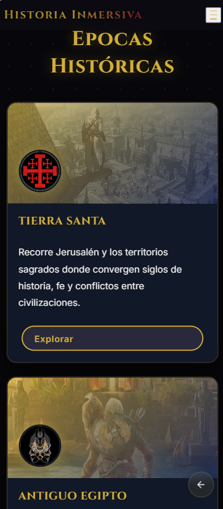

PFO2 - Prompt Engineering en Agentes de IA

<div align="center">

# 🥷⚔️ HISTORIA INMERSIVA ⚔️🥷

### *Aprende Historia. Vive Leyendas.*

</div>

> ### 🦅 "La historia no se estudia, se vive."

Sumérgete en un viaje a través de las épocas más fascinantes de la humanidad. Explora culturas, imperios y acontecimientos históricos mediante una experiencia web inmersiva inspirada en la exploración, el descubrimiento y la aventura.

Desde el **Antiguo Egipto** hasta el **Japón Feudal**, cada sección invita al usuario a recorrer escenarios históricos, descubrir personajes legendarios y aprender de forma interactiva.

---

## 📜 Datos del Estudiante

- **Nombre:** Gisela Stephanie Colmeiro
- **Institución:** Instituto de Formación Técnica Superior (IFTS) N° 29
- **Asignatura:** Desarrollo de Sistemas Web (Front End)
- **Fecha de Entrega:** 26 de Junio del 2026

---

# 🌍 Sobre el Proyecto

Historia Inmersiva es una experiencia web educativa inspirada en la exploración histórica de grandes sagas de videojuegos.

El proyecto busca transformar el aprendizaje tradicional en una aventura interactiva donde el usuario puede recorrer distintas civilizaciones, descubrir acontecimientos históricos y sumergirse en escenarios que marcaron el rumbo de la humanidad.

Desde el **Antiguo Egipto** hasta el **Japón Feudal**, cada sección fue diseñada para combinar:

- 📜 Educación
- 🏛️ Historia
- ⚔️ Aventura
- 🌎 Exploración
- 💻 Tecnología
- 🎮 Experiencias inmersivas

## 🌐 Deploy

Acceso al proyecto desplegado en Vercel:

En el siguiente link podrás acceder al proyecto donde vislumbraran las tres experiencias desarrolladas para el trabajo práctico.

🔗 Sumergete en la Aventura [visitAnimus.vercel.com](https://animus-history.vercel.app/)

---
## Agentes IA utilizados

- OpenCode
- Cursor

---

## 🧠 Prompt Utilizado

A continuación se detalla la instrucción exacta que se utilizo para las dos Ias.

```text
PROYECTO: LANDING PAGE EDUCATIVA INSPIRADA EN ASSASSIN'S CREED
CONTEXTO

Actúa como un desarrollador web senior especializado en UX/UI, diseño de landing pages de alto impacto, accesibilidad y desarrollo frontend moderno.

Tu objetivo es generar una landing page completa, moderna, profesional y totalmente responsive para una plataforma educativa ficticia llamada "Historia Inmersiva".

La plataforma tiene como propósito enseñar historia mediante experiencias inspiradas en videojuegos históricos, especialmente la saga Assassin's Creed, sin utilizar recursos oficiales protegidos por copyright, logotipos registrados ni imágenes propietarias.

El resultado debe ser una landing page visualmente impactante que combine educación, exploración histórica y diseño cinematográfico.

OBJETIVO DEL SITIO

Promocionar una plataforma educativa que permite a los usuarios aprender sobre distintas civilizaciones, culturas y acontecimientos históricos a través de experiencias interactivas inspiradas en videojuegos históricos.

La landing page debe transmitir:
- Aprendizaje
- Exploración
- Aventura
- Historia
- Tecnología
- Inmersión

REQUISITOS OBLIGATORIOS

La página debe contener las siguientes secciones:

1. Header
- Logo textual "Historia Inmersiva"
- Menú de navegación fijo
- Navegación suave entre secciones
- Diseño responsive
- Elementos del menú: Inicio, Épocas, Aprendizaje, Testimonios, Contacto

2. Hero Section
- Debe ocupar toda la pantalla inicial
- Título principal impactante
- Subtítulo descriptivo
- Dos botones CTA
- Fondo visual inspirado en diferentes períodos históricos

3. Sobre Nosotros
- Explicar qué es Historia Inmersiva
- Cómo funciona
- Beneficios educativos

4. Sección de Características
- Mínimo 6 características con icono, título y descripción

5. Épocas Históricas
- Antiguo Egipto, Antigua Grecia, Renacimiento Italiano, Revolución Francesa, Era Vikinga
- Cada una con imagen (gradientes), descripción y botón

6. Testimonios
- Mínimo 3 testimonios ficticios con nombre, rol, comentario y avatar

7. Formulario de Contacto
- Nombre, correo, mensaje y botón enviar (solo maquetación)

8. Footer
- Descripción, redes sociales, derechos reservados, navegación rápida

DISEÑO VISUAL

Paleta: Fondo negro profundo (#0a0a0a), gris oscuro, blanco, dorado antiguo (#c9a84c), rojo oscuro (#8b1a1a)

Estilo: Elegante, épico, inmersivo, profesional, cinematográfico

EXPERIENCIA DE USUARIO
- Scroll suave, animaciones sutiles, efectos hover, transiciones fluidas
- Responsive: móvil, tablet y desktop

ACCESIBILIDAD
- Etiquetas semánticas HTML5
- Contraste adecuado
- Textos alternativos
- Navegación accesible

REQUISITOS TÉCNICOS
- Código completo y funcional
- Sin backend
- Sin frameworks pesados
- Código limpio y organizado
- Priorizar rendimiento
- Evitar dependencias externas innecesarias
```

---

## 📂 Estructura del Proyecto
```
📦 proyecto
├── 📂 agente1_opencode
├── 📂 agente2_cursor
├── 📂 img
├── 📂 prompt
├── 📄 README.md
├── 📄 index.html
├── 📄 script.js
└── 📄 styles.css
```
--- 
## 🛠️ Tecnologías


---
## 📸 Recorrido Visual por la Experiencia

Las siguientes capturas muestran el resultado obtenido mediante los distintos agentes de IA empleados en el desarrollo del proyecto. Cada imagen refleja la adaptación de la interfaz a diferentes dispositivos, garantizando una experiencia inmersiva y accesible. También se incluyen animaciones que permiten observar el funcionamiento de la navegación, los efectos visuales y las interacciones presentes en cada una de las propuestas generadas.

### ⚔️ Página Principal

💻 Vista Escritorio



📱 Vista Tablet



📱 Vista Celular



🎬 Video Interactivo



### 🏛️🥷 Sitio Web Diseñado con OpenCode

💻 Vista Escritorio



📱 Vista Tablet



📱 Vista Celular



🎬 Video Interactivo


### 🏛️ Sitio Web Diseñado con Cursor

💻 Vista Escritorio



📱 Vista Tablet



📱 Vista Celular



🎬 Video Interactivo


---

<div align="center">

### ⚔️ *Nada es verdad, todo está permitido* ⚔️

Proyecto académico desarrollado para **PFO2 - Prompt Engineering en Agentes de IA**

</div>
